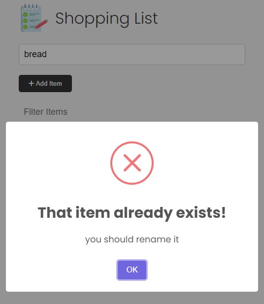

# Shopping List

My own Vanilla JavaScript shopping list app version from Brad Traversy Modern JS course.

This project was created to focus on working with the DOM, events, state, local storage and other fundamentals of JavaScript.

  
  

Demo: still not pulished yet
